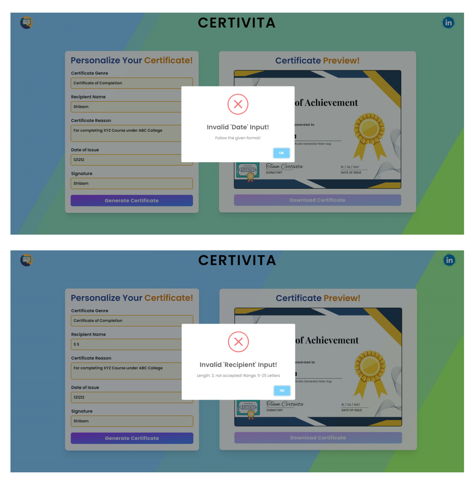
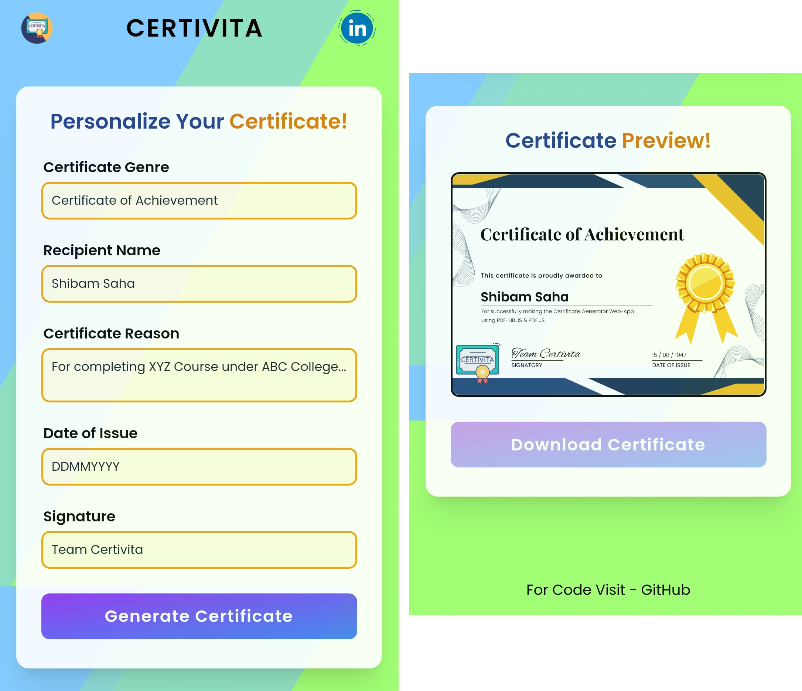

## Certivita - Certificate Generator

**Details**

- This is a Certificate Generator Web Application.
- It takes various input as parameters to make a personalized downloadable certificate in pdf format.
  - Certificate Genre
  - Recipient Name
  - Certificate Reason
  - Date of Issue
  - Signature
- "PDF-LIB JS" is used to modify the certificate where as "PDF JS" is used to show the preview of the certificate.
- User can download the certificate in PDF format (FileSaver JS used).

 

**Live Link**

- [Certivita - Certificate Generator](https://s4shibam-certivita.netlify.app)

 

**Tech Stack**

 

**Additional Libraries**

- PDF LIB JS
- PDF JS
- FileSaver JS
- SweetAlert
- Flowbite JS

 

**Reference Images / Screenshots**

- Landing Page

- Preview of Generated Certificate

- Invalid Input

- Downloaded Certificate (Example)

- Mobile View

 

**Follow Me**

