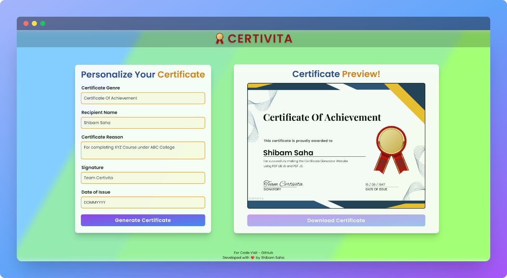
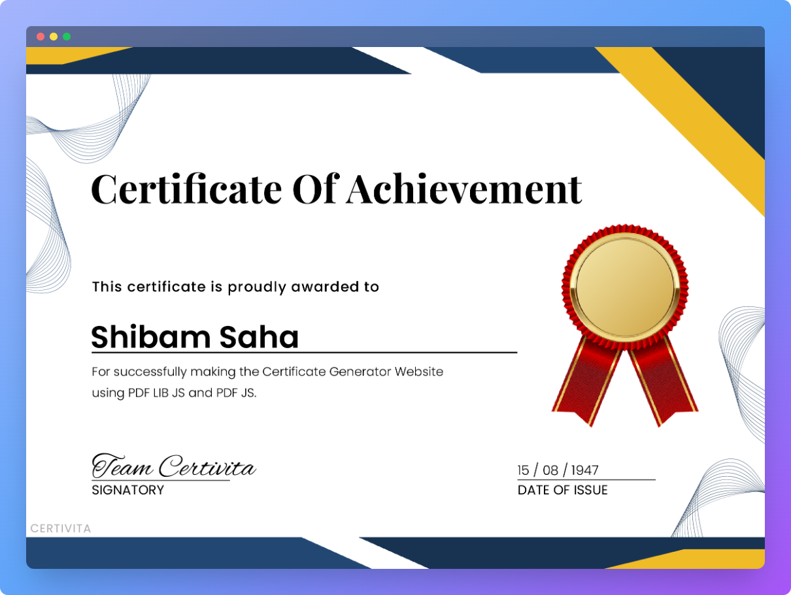

    

    <h1>Certivita</h1>
    
Certificate Generator

    
    
    

 

## ⚡ Introduction

Certivita is an online tool that helps to generate fully customizable personalized certificates.

## ✨ Features
  
-  Generate customizable certificates
-  List of customizable fields:
   -   Certificate Genre
   -   Recipient Name
   -   Certificate Reason
   -   Date of Issue
   -   Signature
-  Download certificate in `.pdf` format

## ⚙️ Tech Stack
  
- HTML
- Tailwind CSS
- JavaScript
- Vite JS

## 📦 Other Libraries and Tools
  
- PDF LIB JS
- PDF JS
- FileSaver JS
- SweetAlert
- Flowbite JS

## 🎯 Goals

- [x] To build an application related to JavaScript `Canvas`
- [x] To gain knowledge regarding file conversion and `pdf` file editing

## 🖼️ Screenshots

## 👋🏻 Contact

